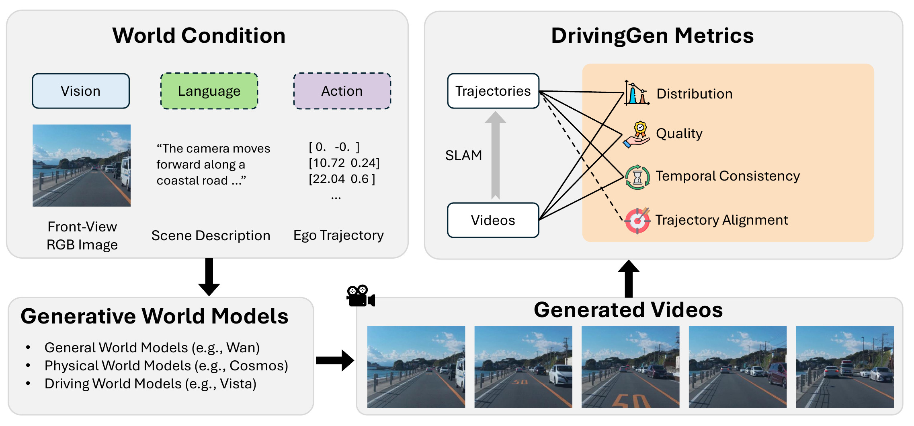

## [DrivingGen: A Comprehensive Benchmark for Generative Video World Models in Autonomous Driving](https://arxiv.org/abs/2601.01528)

<div style="display: flex; flex-wrap: wrap; align-items: center; gap: 10px;">
    <a href='https://arxiv.org/abs/2601.01528'></a>
    <a href='https://drivinggen-bench.github.io/'></a>
    <a href='https://huggingface.co/datasets/yangzhou99/DrivingGen'></a>
    <!-- <a href='https://huggingface.co/spaces/Howieeeee/WorldScore_Leaderboard'></a> -->
</div>

> ### [Yang Zhou](https://yang-zhou-me.github.io/)\* , [Hao Shao](http://hao-shao.com/)\* , [Letian Wang](http://letian-wang.github.io/) , [Zhuofan Zong](https://zongzhuofan.github.io/) , [Hongsheng Li](http://www.ee.cuhk.edu.hk/~hsli/) , [Steven L. Waslander](https://www.trailab.utias.utoronto.ca/) ("*" denotes equal contribution)



## News

- [ ] Yang is currently recovering from holidays and he will clean and organize the code in coming weeks :)

- [x] `[05 Jan., 2026]` We release our paper on [arXiv](https://arxiv.org/abs/2601.01528) and our dataset on [huggingface](https://huggingface.co/datasets/yangzhou99/DrivingGen).


## Citation
If you find our research useful, please cite us as:

```bibtex
@misc{zhou2026drivinggencomprehensivebenchmarkgenerative,
      title={DrivingGen: A Comprehensive Benchmark for Generative Video World Models in Autonomous Driving}, 
      author={Yang Zhou and Hao Shao and Letian Wang and Zhuofan Zong and Hongsheng Li and Steven L. Waslander},
      year={2026},
      eprint={2601.01528},
      archivePrefix={arXiv},
      primaryClass={cs.CV},
      url={https://arxiv.org/abs/2601.01528}, 
}
```

<!-- ## Acknowledgements

This implementation is based on code from other repositories.
- [HiVT](https://github.com/ZikangZhou/HiVT)
- [LMDrive](https://github.com/opendilab/LMDrive)
- [Forecast-MAE](https://github.com/jchengai/forecast-mae) -->

## License

All code within this repository is under [Apache License 2.0](https://www.apache.org/licenses/LICENSE-2.0).