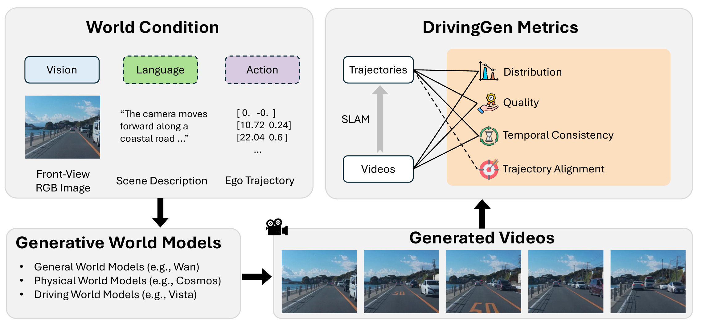

# DrivingGen: A Comprehensive Benchmark for Generative Video World Models in Autonomous Driving

<div style="display: flex; flex-wrap: wrap; align-items: center; gap: 10px;">
    <a href='https://arxiv.org/abs/2601.01528'></a>
    <a href='https://drivinggen-bench.github.io/'></a>
    <a href='https://huggingface.co/datasets/yangzhou99/DrivingGen'></a>
</div>


> #### [DrivingGen: A Comprehensive Benchmark for Generative Video World Models in Autonomous Driving](https://arxiv.org/abs/2601.01528)
>
> ##### [Yang Zhou](https://yang-zhou-me.github.io/)\* , [Hao Shao](http://hao-shao.com/)\* , [Letian Wang](http://letian-wang.github.io/) , [Zhuofan Zong](https://zongzhuofan.github.io/) , [Hongsheng Li](http://www.ee.cuhk.edu.hk/~hsli/) , [Steven L. Waslander](https://www.trailab.utias.utoronto.ca/) ("*" denotes equal contribution)



## Table of Contents

- [Updates](#updates)
- [Overview](#overview)
- [Setup Instructions](#setup-instructions)
- [Video Generation](#video-generation)
- [Evaluation](#evaluation)
- [Benchmarked Models](#benchmarked-models)
- [Citation](#citation)
- [License](#license)

## Updates <a name="updates"></a>

- [03/2026] Evaluation code released.
- [01/2026] We release our paper on [arXiv](https://arxiv.org/abs/2601.01528) and our dataset on [Hugging Face](https://huggingface.co/datasets/yangzhou99/DrivingGen).

## Overview <a name="overview"></a>

Video generation models, as one form of world models, have emerged as one of the most exciting frontiers in AI, promising agents the ability to imagine the future by modeling the temporal evolution of complex scenes. In autonomous driving, this vision gives rise to **driving world models**: generative simulators that imagine ego and agent futures, enabling scalable simulation, safe testing of corner cases, and rich synthetic data generation.

**DrivingGen** is the first comprehensive benchmark for generative driving world models. It combines a diverse evaluation dataset curated from both driving datasets and internet-scale video sources — spanning varied weather, time of day, geographic regions, and complex maneuvers — with a suite of new metrics that jointly assess **visual realism**, **trajectory plausibility**, **temporal coherence**, and **controllability**.

DrivingGen evaluates models from both a **visual perspective** (the realism and overall quality of generated videos) and a **robotics perspective** (the physical plausibility, consistency, and accuracy of generated trajectories). Benchmarking 14 state-of-the-art models reveals clear trade-offs: general models look better but break physics, while driving-specific ones capture motion realistically but lag in visual quality.

## Setup Instructions <a name="setup-instructions"></a>

#### 1. Clone the Repository

```shell
git clone https://github.com/youngzhou1999/DrivingGen.git
cd DrivingGen
```

#### 2. Environment Setup

```shell
conda create -n drivinggen python=3.10
conda activate drivinggen
```

#### 3. Set Environment Variables

Set the Hugging Face and PyTorch cache paths:

```shell
export HF_HOME=./ckpt
export TORCH_HOME=./ckpt
```

#### 4. Download Dataset

Download the **DrivingGen** dataset from Hugging Face. First, update your Hugging Face token in `drivinggen/down_dataset.py`, then run:

```shell
bash scripts/0-down_data.sh
```

The dataset will be downloaded to `./data/`.

## Video Generation <a name="video-generation"></a>

This section guides you through generating videos for evaluation using your own world generation model. We provide an example using **Wan2.2-14B** (Image-to-Video).

#### 1. Run Inference

Configure and run video generation:

```shell
bash scripts/1-example_infer_model.sh
```

Key parameters in the script:

```shell
video_path=data/ego_condition.json   # Input metadata
out_dir=cache/infer_results          # Output directory
split=ego_condition                  # Data split (ego_condition / open_domain)
model=wan2.2-14b                     # Model name
exp_id=default_prompt                # Experiment ID
```

The generated videos (101 frames at 10 fps, 576x1024 resolution) will be saved as both MP4 videos and individual PNG frames.

#### 2. Extract Ego Trajectory

Extract ego vehicle trajectory from generated videos using UniDepthV2 and Visual SLAM:

```shell
bash scripts/2-get_ego_traj.sh
```

#### 3. Extract Agent Trajectories

Extract agent trajectories using YOLOv10 detection and depth estimation:

```shell
bash scripts/3-get_agent_traj.sh
```

## Evaluation <a name="evaluation"></a>

DrivingGen evaluates generated videos using comprehensive **video metrics** and **trajectory metrics**.

### Video Metrics

Evaluates visual quality and temporal coherence of generated videos:

| Category | Metrics |
| --- | --- |
| **Distribution** | FVD (Frechet Video Distance) |
| **Objective Quality** | IEEE P2020 automotive imaging metrics (sharpness, exposure, contrast, color, noise, artifacts, texture, temporal) |
| **Subjective Quality** | CLIP-IQA+ based assessment |
| **Scene Consistency** | DINOv3 feature-based consistency |
| **Agent Consistency** | Agent appearance consistency and missing detection |
| **Perceptual** | LPIPS, SSIM |

Run video evaluation:

```shell
bash scripts/4-get_video_metrics.sh
```

### Trajectory Metrics

Evaluates the physical plausibility and accuracy of generated trajectories:

| Category | Metrics |
| --- | --- |
| **Distribution** | FTD (Frechet Trajectory Distance) via Motion Transformer encoder |
| **Alignment** | ADE, FDE, Success Rate, Hausdorff Distance, DTW |
| **Quality** | Comfort Score (jerk, acceleration, yaw rate), Curvature RMS, Speed Score |
| **Consistency** | Velocity Consistency, Acceleration Consistency |

Run trajectory evaluation:

```shell
bash scripts/5-get_traj_metrics.sh
```

Results will be saved to `cache/eval_logs/`.

## Benchmarked Models <a name="benchmarked-models"></a>

DrivingGen benchmarks **14 state-of-the-art models** across three categories:

| Category | Models |
| --- | --- |
| **General Video World Models** | Gen-3, Kling, CogVideoX, Wan, HunyuanVideo, LTX-Video, SkyReels |
| **Physical World Models** | Cosmos-Predict1, Cosmos-Predict2 |
| **Driving-Specific World Models** | Vista, DrivingDojo, GEM, VaViM, UniFuture |

## Citation <a name="citation"></a>

If you find our research useful, please cite us as:

```bibtex
@misc{zhou2026drivinggencomprehensivebenchmarkgenerative,
      title={DrivingGen: A Comprehensive Benchmark for Generative Video World Models in Autonomous Driving},
      author={Yang Zhou and Hao Shao and Letian Wang and Zhuofan Zong and Hongsheng Li and Steven L. Waslander},
      year={2026},
      eprint={2601.01528},
      archivePrefix={arXiv},
      primaryClass={cs.CV},
      url={https://arxiv.org/abs/2601.01528},
}
```

## License <a name="license"></a>

All code within this repository is under [Apache License 2.0](https://www.apache.org/licenses/LICENSE-2.0).
