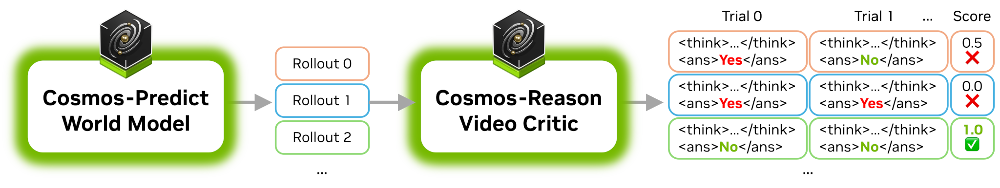
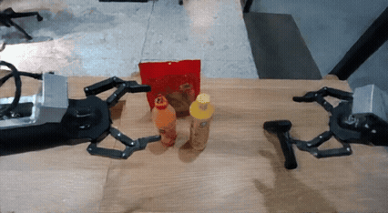
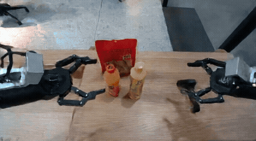
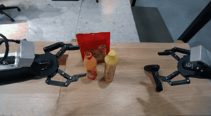
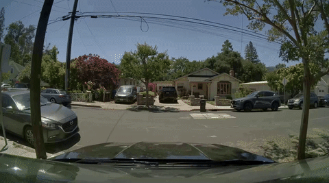

# Using Cosmos-Reason1 as Video Critic for Rejection Sampling

<p align="center">
  
</p>

Cosmos-Reason1 is capable of evaluating whether a video adhere to fundamental physical laws such as Gravity, Object Permanency, Collision dynamics, and Cause-and-effect relationships.

When paired with a world model such as [Cosmos-Predict2](https://github.com/nvidia-cosmos/cosmos-predict2/), it enables best-of-N sampling by generating multiple video candidates and selecting the most physically accurate ones, thereby improving generation quality.

## Step 1 - Generating Multiple Rollouts

Using the same input, the world model generates multiple video rollouts. Among these, some exhibit greater physical plausibility than others.

<table>
  <tr>
    <td align="center">
      <strong>Generation 0</strong><br>
      
    </td>
    <td align="center">
      <strong>Generation 1</strong><br>
      
    </td>
  </tr>
  <tr>
    <td align="center">
      <strong>Generation 2</strong><br>
      
    </td>
    <td align="center">
      <strong>Generation 3</strong><br>
      
    </td>
  </tr>
</table>

 The videos above are generated by [Cosmos-Predict2-2B-Video2World](https://huggingface.co/nvidia/Cosmos-Predict2-2B-Video2World).

## Step 2 - Evaluating the Physical Accuracy using Cosmos-Reason1

Cosmos-Reason1 is tasked to analyze each video element-by-element, and organize the analysis process in a structured format for easy parsing. To obtain a fine-grained assessment, each video undergoes multiple evaluation trials (4 in this example). The quality score is calculated as the ratio of artifact-free evaluations to the total number of evaluations. The video with the highest score is retained as the final high-quality output.

| Video | Evaluation and Example Output |
|-------|-------------------|
|  | Score: 0.0 <br><br> [Raw Output](assets/generation_0_raw_output.txt) <br><br> [Formatted Output](assets/generation_0_formatted.md) |
|  | **Score: 0.75 (Best)** <br><br> [Raw Output](assets/generation_1_raw_output.txt) <br><br> [Formatted Output](assets/generation_1_formatted.md) |
|  | Score: 0.25 <br><br> [Raw Output](assets/generation_2_raw_output.txt) <br><br> [Formatted Output](assets/generation_2_formatted.md) |
|  | Score: 0.5 <br><br> [Raw Output](assets/generation_3_raw_output.txt) <br><br> [Formatted Output](assets/generation_3_formatted.md) |

## Example

We provide an [example script](video_critic.py) that demonstrates how to parse the Cosmos-Reason1 output and reformat it into an html report:

```bash
./examples/video_critic/video_critic.py --video_path assets/sample.mp4
```

Launch a server to view the generated report `assets/sample.html`:

```bash
python -m http.server 8000 -d assets
```

Example output:

<table>
  <tr>
    <td>
      <p>User prompt: Is it safe to turn right?</p>
      <br/>
    </td>
    <td style="vertical-align: top; padding-left: 20px;">
      <!-- Text on the right -->
      <p>Assistant response: </p>
      <p>
&lt;think&gt;
Okay, let's see. The user is asking if it's safe to turn right based on the video provided. First, I need to ...
The key points here are the parked vehicles. There are cars parked on both sides of the road, ...
&lt;/think&gt;

&lt;answer&gt;
Based on the video, turning right may not be entirely safe due to the following factors: ...
&lt;/answer&gt;
      </p>
    </td>
  </tr>
  <tr>
    <td>
      <p>User prompt: Analyze the video for any artifacts or anomalies.</p>
      <br/>
    </td>
    <td style="vertical-align: top; padding-left: 20px;">
      <!-- Text on the right -->
      <p>Assistant response:</p>
      <p>
&lt;component name="Orange Bottle Interaction"&gt;<br>
&lt;analysis&gt;
The left robot arm approaches the orange bottle and makes contact with it. However, instead of grasping the bottle firmly, the gripper wraps around it in an awkward manner, failing to secure a proper hold ... suggesting a glitch in the interaction physics. &lt;/analysis&gt;<br>
&lt;/component&gt;<br>
...
      </p>
    </td>
  </tr>
</table>
