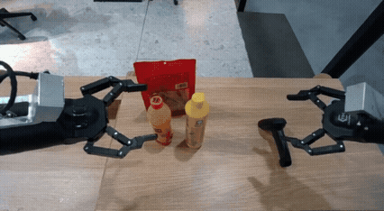

# Video Analysis - Generation 1

## Overview
The video shows a scene set up like a checkout counter with two robotic arms positioned on either side of the counter. On the counter, there are three distinct objects: an orange bottle, a yellow bottle, and a red plastic bag containing snacks. A barcode scanner is placed near the right robot arm. The video captures the moment when the left robot arm begins to interact with the orange bottle, lifting it slightly off the surface. The right robot arm remains stationary throughout the captured frames.

## Component Analysis

### Robot Arm (Left)
The left robot arm is metallic with joints and segments designed for precise movement. It appears to be equipped with a gripping mechanism that makes contact with the orange bottle. The arm moves smoothly and deliberately, indicating no immediate issues with its motion. The gripping mechanism properly grasps the orange bottle without penetrating or deforming it. There are no visual artifacts associated with the arm's structure or function. The arm's interaction with the orange bottle is consistent with the intended purpose of a robotic arm in a simulated environment.

**Anomaly**: 🟢 No 🟢

### Orange Bottle
The orange bottle is transparent with a label and cap, and it initially rests on the counter before being lifted by the robot arm. The bottle behaves realistically when lifted—it tilts slightly due to gravity as expected. There is no sudden change in its shape or appearance. The bottle does not pass through any solid surfaces, ensuring physical realism. The interaction between the bottle and the robot arm is logical and follows the laws of physics.

**Anomaly**: 🟢 No 🟢

### Yellow Bottle
Similar in design to the orange bottle, the yellow bottle remains stationary on the counter throughout the sequence. The bottle does not exhibit any unexpected movements or changes in position. It stays firmly on the surface, demonstrating proper adherence to gravity. No visual glitches affect the bottle's appearance or placement.

**Anomaly**: 🟢 No 🟢

### Red Plastic Bag
The red plastic bag contains what appears to be snack items and is placed behind the bottles on the counter. The bag remains static and does not react unrealistically to the actions of the robot arm or the bottles. Its position and form remain consistent, with no signs of penetration or morphing. The bag's material behaves naturally, maintaining its integrity throughout the scene.

**Anomaly**: 🟢 No 🟢

### Barcode Scanner
A handheld device located near the right robot arm, the scanner remains unused during these frames. The scanner does not move or interact with any other objects in the scene. This lack of interaction is appropriate since the scanner is not currently in use. The scanner retains its expected appearance and position, showing no visual artifacts.

**Anomaly**: 🟢 No 🟢

### Counter Surface
A flat wooden surface serving as the base for all objects, the counter provides a stable platform for the bottles and bag. The surface remains intact and undisturbed by the robot arm's interaction with the orange bottle. There are no visible deformations or unrealistic reactions to the applied force. The spatial relationship between the objects and the counter is maintained correctly.

**Anomaly**: 🟢 No 🟢

### Right Robot Arm
Positioned on the right side of the counter, this arm remains inactive during the captured frames. No movement or interaction occurs, which aligns with the current state of inactivity. The arm maintains its structural integrity without any visual artifacts. The positioning relative to the other components is logical and free from errors.

**Anomaly**: 🟢 No 🟢

## Final Assessment
**Result**: 🟢 No 🟢
